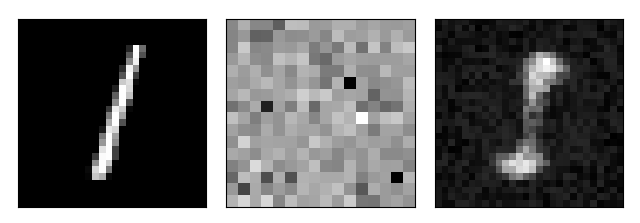

# Neuronal networks with Numpy 

This project is my Neural Network playground with Numpy.

Result of the autoencoder (Left: Original, Middle: Latent space, Right: Reconstructed image):


### Requirements
- numpy==1.18.5
- autograd==1.3

### Neural Networks
- Multi class classification
- Binary classification
- Real valued regression
- Auto-Encoder
- Stacked (Deep) Auto-Encoder
- Error back-propagation multi-layer perceptron

### Gradient based optimizations
- Mini batched gradient descent
- Gradient descent
- Momentum driven gradient descent
- Nestorov driven gradient descent
- Adagrad
- Adam

### Categorical classification

```python
from nn.data import generate_categorical_data
from nn.activations import Relu, Softmax
from nn.losses import CrossEntropy
from nn.nn import NeuralNetwork
from nn.optimizers import MomentumGradientDescent

X, Y = generate_categorical_data()
layers = [X.shape[0], 512, 256, 256, 128, Y.shape[0]]
optimizer = MomentumGradientDescent(0.001, len(layers), momentum=0.9)
net = NeuralNetwork(layers, Relu(), Softmax(), CrossEntropy(), optimizer)
loss = net.train(X, Y)
```

Model's learning curve


### Binary classification

```python
from nn.nn import NeuralNetwork
from nn.data import generate_binary_data
from nn.activations import Relu, Sigmoid
from nn.losses import CrossEntropy
from nn.optimizers import MomentumGradientDescent

X, Y = generate_binary_data()
layers = [X.shape[0], 512, 256, 256, 128, 1]
optimizer = MomentumGradientDescent(0.001, len(layers), momentum=0.9)
net = NeuralNetwork(layers, Relu(), Sigmoid(), CrossEntropy(), optimizer)
loss = net.train(X, Y)
```

Model's learning curve


### Autoencoder

```python
from nn.data import generate_categorical_data
from nn.activations import Relu, LinearActivation
from nn.losses import MeanAbsoluteError
from nn.nn import NeuralNetwork
from nn.optimizers import MomentumGradientDescent

X, Y = generate_categorical_data()
layers = [X.shape[0], 512, 256, 256, 128, 512]
optimizer = MomentumGradientDescent(0.001, len(layers), momentum=0.9)
net = NeuralNetwork(layers, Relu(), LinearActivation(), MeanAbsoluteError(), optimizer)
loss = net.train(X, X)
```

Model's learning curve


### Regression problem

```python
from nn.data import generate_regression_data
from nn.activations import Relu, LinearActivation
from nn.losses import MeanAbsoluteError
from nn.nn import NeuralNetwork
from nn.optimizers import MomentumGradientDescent

X, Y = generate_regression_data()
layers = [X.shape[0], 32, 1]
optimizer = MomentumGradientDescent(0.001, len(layers), momentum=0.9)
net = NeuralNetwork([X.shape[0], 32, 1], Relu(), LinearActivation(), MeanAbsoluteError(), optimizer)
loss = net.train(X, Y)
```
